# 🏦 금융 상품 추천 서비스

## 📋 프로젝트 개요
- **프로젝트명**: 금융 상품 추천 서비스
- **개발 기간**: 2024.11.18 ~ 2024.11.26
- **팀원**: 김정우, 안주민

## 🎯 기획 배경
### 현재 금융 환경의 문제점
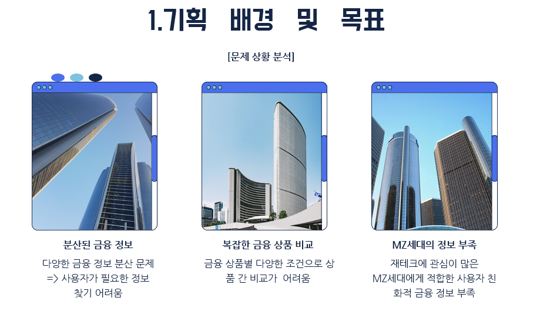
- 분산된 금융 정보로 인한 정보 접근성 문제
- 복잡한 금융 상품 비교의 어려움
- MZ세대의 재테크 관심 증가와 정보 부족

### 사용자 요구사항
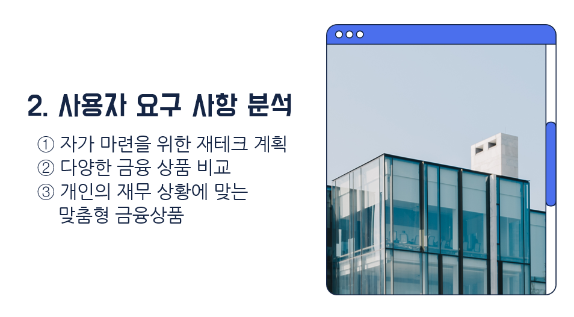
- 재테크 계획 수립 필요성
- 통합된 금융 상품 비교 플랫폼 필요
- 맞춤형 금융 정보 제공 요구

### 시장 현황
- 유사 서비스 분석 및 차별점
- 사용자 페르소나 정의 (재테크 관심 초보 투자자)

## 🗓 개발 일정, ERD
### 개발 일정
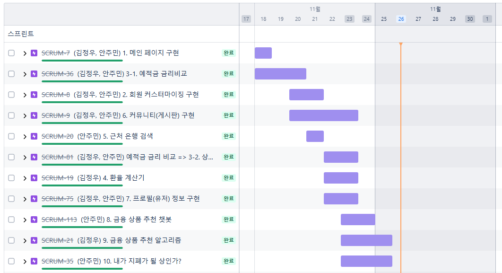

### ERD 설계
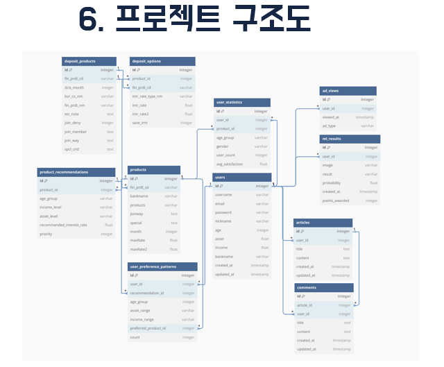

## 📚 주요 기능 + 프로젝트 기능 상세
### 1. 예적금 추천 시스템
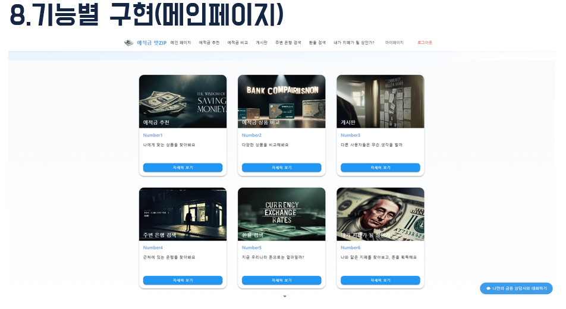
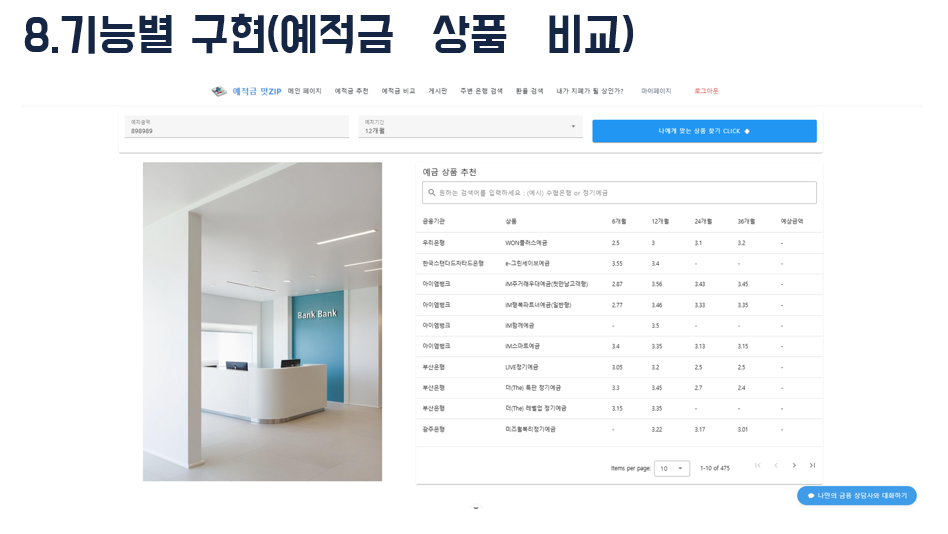
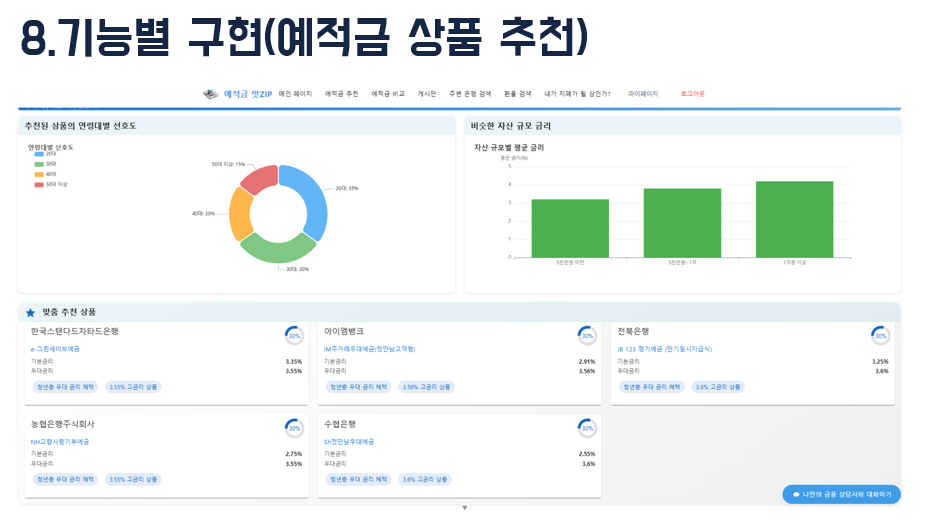
- 사용자 맞춤형 금융 상품 추천  
<video controls src="assets/예금 상품 비교.mp4" title="예금 상품 비교"></video>

- 연령대별/자산 규모별 선호도 분석  
<video controls src="assets/프로필과 장바구니 상품 추천.mp4" title="프로필과 장바구니 상품 추천"></video>

- 실시간 금리 정보 반영  
<video controls src="assets/상품 저장 및 비교.mp4" title="상품 저장 및 비교"></video>

### 2. 금융 상품 비교
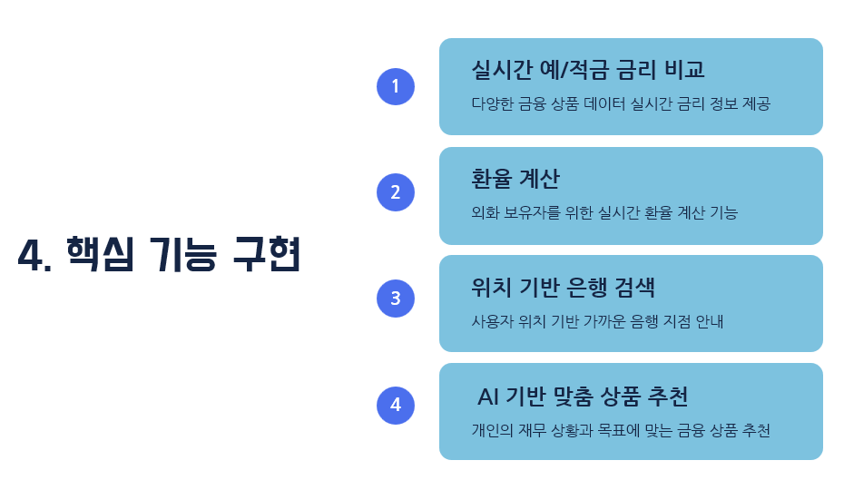
- 금융감독원 API 연동 예적금 상품 비교
- 예치금액/기간별 최적 상품 추천
- 예상 수익금 계산 및 정렬 기능

### 3. 커뮤니티 기능 
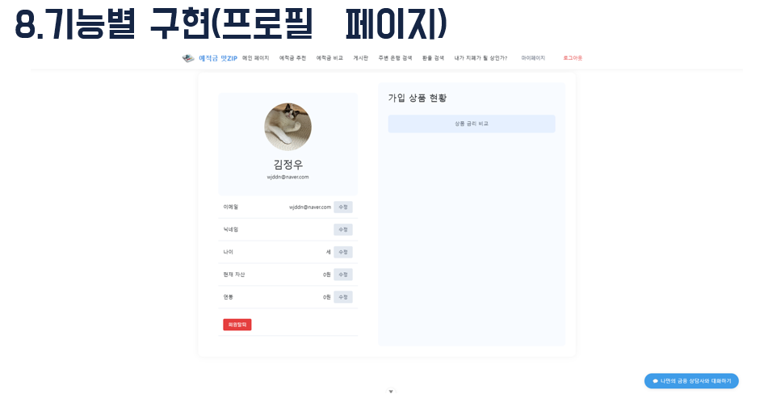
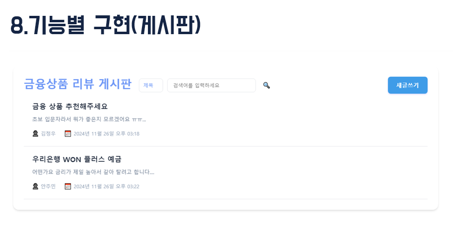
- 금융 상품 리뷰 게시판 
- 제목/작성자/내용별 필터링  
<video controls src="assets/커뮤니티 기능.mp4" title="커뮤니티 기능"></video>

- 팔로우/팔로잉 시스템  
<video controls src="assets/팔로우 및 게시글 이동.mp4" title="팔로우 및 게시글 이동"></video>

- 사용자 프로필 연동 
- 로그인 / 회원가입 기능  
<video controls src="assets/회원가입 로그인.mp4" title="회원가입 로그인"></video>

### 4. 부가 서비스 
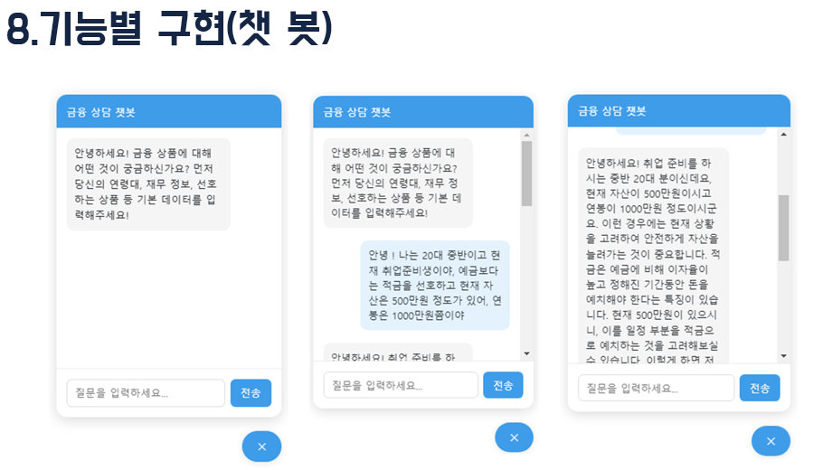
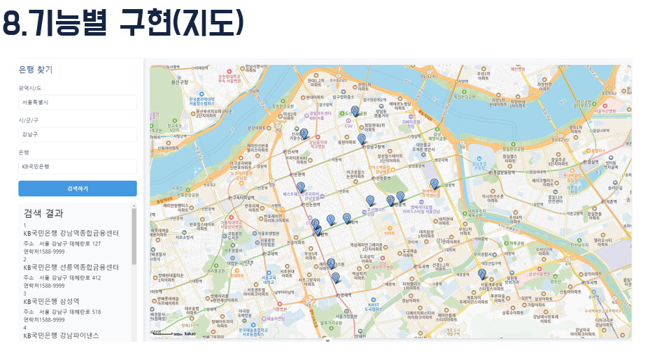
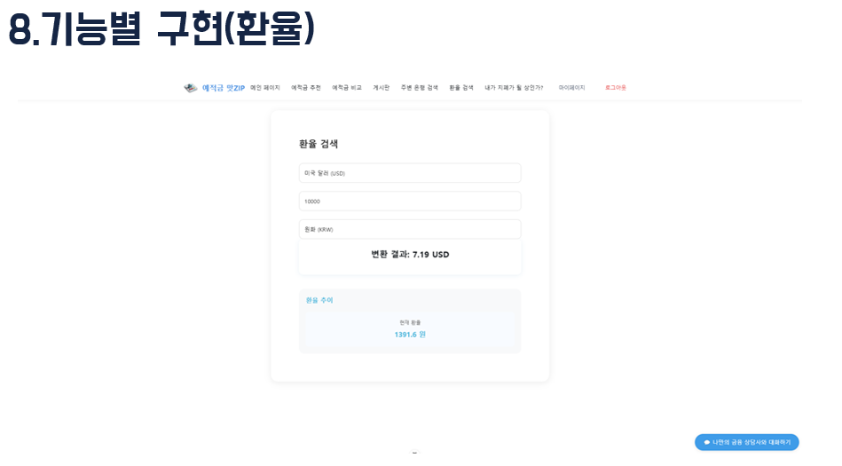
- 실시간 환율 정보 제공  
<video controls src="assets/환율.mp4" title="환율 정보"></video>

- 카카오맵 API 활용 주변 은행 찾기  
<video controls src="assets/지도.mp4" title="주변 은행 찾기"></video>

- AI 기반 "나와 닮은 지폐 찾기"   
<video controls src="assets/관상.mp4" title="지폐 찾기"></video>

- GPT 기반 금융 상품 추천 챗봇  
<video controls src="assets/챗봇 금융 상품 추천.mp4" title="챗봇 추천"></video>

## 👥 역할 분담 
|                                                                                                  |                                                                                                  |
| :----------------------------------------------------------------------------------------------: | :----------------------------------------------------------------------------------------------: |
|  |  |
| [김정우](https://github.com/zwjddn1105) | [안주민](https://github.com/JUMINAHN) |
| Frontend & Backend | Frontend & Backend |

### 김정우 
- Backend API 개발 
- 데이터베이스 설계 
- 금융 상품 추천 알고리즘 
- 환율 계산 기능 
- 커뮤니티 백엔드 로직 

### 안주민 
- Frontend UI/UX 설계 
- 컴포넌트 개발 
- 반응형 디자인 
- 카카오맵 API 연동 
- 사용자 인터페이스 최적화 

 

# 🎸 기타 사항
## 💡 개선 사항 
- 모바일 앱 확장 
- 광고 수익 모델 구축 
- 추가 금융 상품 카테고리 확장 
- 계정 접속 방법 다양화 
- 추천 알고리즘 고도화 

## 📌 트러블 슈팅 
### 1. Axios 순환 참조 오류 
 - **문제**: Vue의 반응형 객체 직접 전송 시 발생하는 오류  
 - **해결**: 데이터를 일반 객체로 변환 후 전송 

### 2. 인증 토큰 관리  
 - **문제**: 로그인 시 토큰 인증 실패  
 - **해결**: Django REST Framework 설정 수정 및 토큰 헤더 추가 

## 🌟 프로젝트 성과 
 - 🌟 SSAFY(삼성 청년 소프트웨어 아카데미) 관통 PJT 우수상 🌟  
 - 실시간 금융 데이터 연동  
 - 사용자 맞춤형 추천 시스템 구현  
 - 직관적인 UI/UX 구현  

## 👥 팀원 소감 
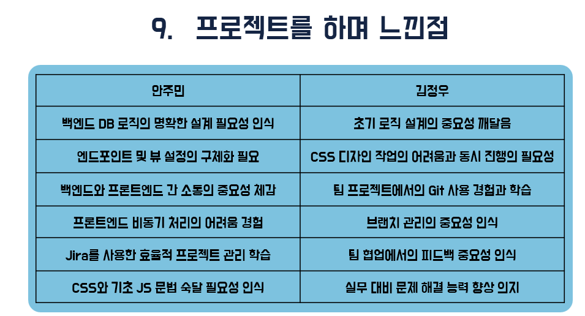

### 안주민 
1. 백엔드 DB 로직의 명확한 설계 필요성 인식  
2. 엔드포인트 및 뷰 설정의 구체화 필요  
3. 백엔드와 프론트엔드 간 소통의 중요성 체감  
4. 프론트엔드 비동기 처리의 어려움 경험  
5. Jira 툴 사용으로 효율적 프로젝트 관리 학습  
6. CSS와 기초 JS 문법 숙달 필요성 인식  

### 김정우 
1. 초기 로직 설계의 중요성 깨달음  
2. CSS 디자인 작업의 어려움과 동시 진행의 필요성  
3. 팀 프로젝트에서의 Git 사용 경험과 학습  
4. 브랜치 관리의 중요성 인식  
5. 팀 협업에서의 피드백 중요성 인식  
6. 실무 대비 문제 해결 능력 향상 의지  

## ⚙️ 개발 환경 
### Frontend 
 - Vue.js 3  
 - Vuetify  
 - Pinia   
 - Chart.js, ECharts   
 - TensorFlow.js   
 - Bootstrap   
 - Axios   
 - SweetAlert2   

### Backend   
 - Django 4.2.16   
 - Django REST Framework   
 - Python 3.9   
 - Django Allauth   
 - Django CORS Headers   

## 📚 참고 자료   
 - [Vue.js 공식 문서](https://vuejs.org/)   
 - [Django 공식 문서](https://docs.djangoproject.com/)   
 - [Vuetify 문서](https://vuetifyjs.com/)   
 - [Django REST Framework 문서](https://www.django-rest-framework.org/)   
