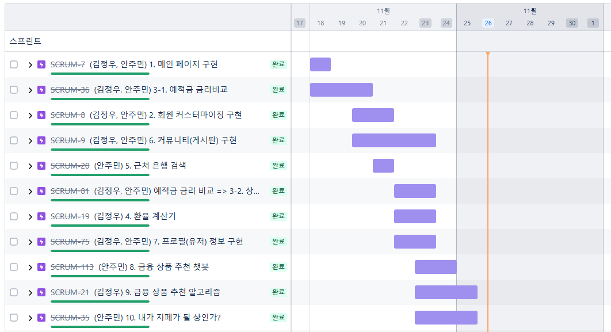

# 종합 프로젝트

## 프로젝트 결과

### 1. 팀

* 프로젝트 진행 날짜 : 2024.11.18 ~ 2024.11.26

* 역할 분담
1. 메인 페이지 구현
  (김정우) 메인페이지 동적 화면 UI/UX 수정/보완 : 프론트
  (안주민) UI/UX 동적 화면 꾸리기(10초 페이징) : 프론트
  (안주민) 미접속시, 금융 추천 서비스 접속 방지 : 프론트
  (안주민) 메인페이지 동적 화면 UI/UX 수정/보완 : 프론트

2. 회원가입 / 로그인 구현
  (김정우) 로그인 DjangoRestAPI받아오기 : 백앤드
  (김정우) 회원가입 DjangoRestApi 받아오기 : 백앤드
  (김정우) 로그인 토큰 받아오기 : 프론트 (보완)
  (안주민) 로그인에 맞는 인터페이스 구현 및 연동하기 : 프론트
  (안주민) 회원가입 인터페이스 구현 및 연동하기 : 프론트
  (안주민) 로그인 토큰 받아오기 : 프론트 (보완)

3. 예적금 금리 비교
  (김정우) 예/적금 DB 정보 가져오기 : 백엔드
  (김정우) 예/적금 DB 정보 NULL 문제 해결 : 백엔드
  (김정우) 예/적금 DB 정보 1차 가공 : 백엔드
  (안주민) 예/적금 페이지 vuetify 사용으로 메인 화면 가시화 : 프론트
  (안주민) 백엔드 데이터 리스트 목록 프론트에서 2차 가공 : 프론트

4. 예적금 상세 정보 조회
  (김정우) 예/적금 상세 DB 1차 가공 : 백엔드
  (김정우) 관심 상품을 보관할 수 있는 장바구니 기능을 위한 DB 모델 및 정보 생성 & 기능 로직 구현 : 백엔드
  (김정우) 상품 정보, 유저, 관심 상품 연계 DB 모델 및 정보 생성 & 기능 로직 구현 : 백엔드
  (김정우) 장바구니 알림 모델 구현 : 프론트
  (안주민) 관심 상품 추가/제거 관련 이벤트 구현 : 프론트
  (안주민) 예/적금 상세 페이지 vuetify 사용으로 메인 화면 가시화 : 프론트
  (안주민) 백엔드 데이터 리스트 목록 프론트에서 DB 2차 가공 : 프론트
  (안주민) 장바구니 및 프로필 연계 로직 구현 서포트 및 보완 : 백엔드

5. 주변 은행 찾기
  (안주민) 카카오맵 API JS 버전으로 다운로드 : 프론트
  (안주민) 유저 친화적 UI/UX 인터페이스 가시화 : 프론트

6. 환율 계산 기능
  (김정우) 환율 계산 정보 DB 가공 : 백엔드
  (김정우) 환율 계산 로직 구현 DB 2차 가공 : 백엔드
  (김정우) 유저 친화적 UI/UX 인터페이스 가시화 : 프론트
  (김정우) 서버 에러 작동시 발생되는 알림 이벤트 모델 구현 : 프론트

7. 프로필 / 유저 정보
  (김정우) 유저 정보 및 상품 연계 DB 구현 : 백엔드
  (김정우) 유저 DB 정보 추가 업데이트 진행(자산/연봉) : 백엔드
  (김정우) 회원 탈퇴 기능 구현 : 백엔드
  (김정우) 마이페이지 Hover 기능 수정 : 프론트
  (안주민) 마이페이지 프로필 UI/UX 인터페이스 구현 : 프론트
  (안주민) 마이페이지 프로필 정보/수정 기능 구현 : 프론트
  (안주민) 마이페이지 정보 클릭 이벤트 및 차트화 구현 : 프론트
  (안주민) 다른 유저 개인 프로필 조회(게시글 내용과 연동) 기능 구현 : 프론트

8. 커뮤니티 게시판 구현
  (김정우) 게시글 좋아요 COUNT DB 생성 : 백엔드
  (김정우) 유저 댓글 연동 DB 구현 : 백엔드
  (김정우) 게시글 UI/UX 인터페이스 구현 : 프론트
  (김정우) 게시글 C/R/U/D 로직 보완 : 백엔드
  (김정우) 로그인 AUTH TOKEN 이슈 확인/보완 : 백엔드
  (김정우) UI/UX 인터페이스 구현 및 수정 : 프론트
  (김정우) 팔로우/팔로워 로직 기능 구현 : 백엔드
  (안주민) 게시글 좋아요 인터페이스 생성 : 프론트
  (안주민) 게시글 C/R/U/D (생성/조회/수정/삭제) 로직 구현 : 백엔드
  (안주민) 로그인 AUTH TOKEN 이슈 확인/보완 : 백엔드
  (안주민) 회원 별 팔로우/팔로워 로직 인터페이스 구현 : 프론트
  (안주민) 회원 정보 인터페이스 내 게시글/댓글 로직 확인 기능 구현 : 프론트
  (안주민) UI/UX 인터페이스 구현 및 수정 : 프론트

9. 금융 상품 추천 알고리즘
  (김정우) 백엔드 로직 및 유저별 상품 데이터 카테고리 DB 분류 : 백엔드
  (김정우) 상품 데이터 차트 가시화 및 인터페이스 배치 분류 및 수정 : 프론트
  (안주민) 백엔드 로직 및 유저별 상품 데이터 카테고리 DB 분류 : 백엔드
  (안주민) 상품 데이터 차트 가시화 및 인터페이스 배치 분류 : 프론트

10. 내가 지폐가 될 상인가 구현(콘텐츠)
  (김정우) 광고 이벤트 구현 : 프론트
  (안주민) 광고 이벤트 구현 아이디어 제공
  (안주민) 인터페이스 화면 구현
  (안주민) 티쳐블 머신 데이터 받아오기 및 프론트 UI/UX 배치

#### 프로젝트 단계별 역할(사람 중심) 분담표
| 단계 | 기능 | 김정우 | 안주민 |
| --- | --- | --- | --- |
| 1 | 메인 페이지 구현 | • 메인페이지 동적 화면 UI/UX 수정/보완 (프론트) | • UI/UX 동적 화면 꾸리기(10초 페이징) (프론트)
• 미접속시, 금융 추천 서비스 접속 방지 (프론트)
• 메인페이지 동적 화면 UI/UX 수정/보완 (프론트) |
| 2 | 회원가입 / 로그인 구현 | • 로그인 DjangoRestAPI 받아오기 (백엔드)
• 회원가입 DjangoRestApi 받아오기 (백엔드)
• 로그인 토큰 받아오기 (프론트, 보완) | • 로그인에 맞는 인터페이스 구현 및 연동 (프론트)
• 회원가입 인터페이스 구현 및 연동 (프론트)
• 로그인 토큰 받아오기 (프론트, 보완) |
| 3 | 예적금 금리 비교 | • 예/적금 DB 정보 가져오기 (백엔드)
• 예/적금 DB 정보 NULL 문제 해결 (백엔드)
• 예/적금 DB 정보 1차 가공 (백엔드) | • 예/적금 페이지 vuetify 사용으로 메인 화면 가시화 (프론트)
• 백엔드 데이터 리스트 목록 프론트에서 2차 가공 (프론트) |
| 4 | 예적금 상세 정보 조회 | • 예/적금 상세 DB 1차 가공 (백엔드)
• 관심 상품 장바구니 기능 DB 모델 및 로직 구현 (백엔드)
• 상품 정보, 유저, 관심 상품 연계 DB 모델 및 로직 구현 (백엔드)
• 장바구니 알림 모델 구현 (프론트) | • 관심 상품 추가/제거 관련 이벤트 구현 (프론트)
• 예/적금 상세 페이지 vuetify 사용으로 화면 가시화 (프론트)
• 백엔드 데이터 리스트 목록 프론트에서 DB 2차 가공 (프론트)
• 장바구니 및 프로필 연계 로직 구현 서포트 및 보완 (백엔드) |
| 5 | 주변 은행 찾기 | - | • 카카오맵 API JS 버전으로 다운로드 (프론트)
• 유저 친화적 UI/UX 인터페이스 가시화 (프론트) |
| 6 | 환율 계산 기능 | • 환율 계산 정보 DB 가공 (백엔드)
• 환율 계산 로직 구현 DB 2차 가공 (백엔드)
• 유저 친화적 UI/UX 인터페이스 가시화 (프론트)
• 서버 에러 작동시 발생되는 알림 이벤트 모델 구현 (프론트) | - |
| 7 | 프로필 / 유저 정보 | • 유저 정보 및 상품 연계 DB 구현 (백엔드)
• 유저 DB 정보 추가 업데이트 진행(자산/연봉) (백엔드)
• 회원 탈퇴 기능 구현 
• 마이페이지 Hover 기능 수정 (프론트) | • 마이페이지 프로필 UI/UX 인터페이스 구현 (프론트)
• 마이페이지 프로필 정보/수정 기능 구현 (프론트)
• 마이페이지 정보 클릭 이벤트 및 차트화 구현 (프론트)
• 다른 유저 개인 프로필 조회 기능 구현 (프론트) |
| 8 | 커뮤니티 게시판 구현 | • 게시글 좋아요 COUNT DB 생성 (백엔드)
• 유저 댓글 연동 DB 구현 (백엔드)
• 게시글 UI/UX 인터페이스 구현 (프론트)
• 게시글 C/R/U/D 로직 보완 (백엔드)
• 로그인 AUTH TOKEN 이슈 확인/보완 (백엔드)• UI/UX 인터페이스 구현 및 수정 (프론트)
• 팔로우/팔로워 로직 기능 구현 (백엔드) | • 게시글 좋아요 인터페이스 생성 (프론트)
• 게시글 C/R/U/D 로직 구현 (백엔드)
• 로그인 AUTH TOKEN 이슈 확인/보완 (백엔드)
• 회원 별 팔로우/팔로워 로직 인터페이스 구현 (프론트)
• 회원 정보 인터페이스 내 게시글/댓글 로직 확인 기능 구현 (프론트)
• UI/UX 인터페이스 구현 및 수정 (프론트) |
| 9 | 금융 상품 추천 알고리즘 | • 백엔드 로직 및 유저별 상품 데이터 카테고리 DB 분류 (백엔드)
• 상품 데이터 차트 가시화 및 인터페이스 배치 분류 및 수정 (프론트) | • 백엔드 로직 및 유저별 상품 데이터 카테고리 DB 분류 (백엔드)
• 상품 데이터 차트 가시화 및 인터페이스 배치 분류 (프론트) |
| 10 | 내가 지폐가 될 상인가 구현(콘텐츠) | • 광고 이벤트 구현 (프론트) | • 광고 이벤트 구현 아이디어 제공<br>• 인터페이스 화면 구현
• 티쳐블 머신 데이터 받아오기 및 프론트 UI/UX 배치 |

#### 프론트 엔드와 백엔드 중심 역할 중심 분담표`
##### 프론트엔드 작업
| 기능 | 김정우 | 안주민 |
| --- | --- | --- |
| UI/UX 구현 | • 메인페이지 동적 화면 UI/UX 수정/보완
• 환율 계산 기능 UI/UX 인터페이스 가시화
• 장바구니 알림 모델 구현 | • UI/UX 동적 화면 꾸리기(10초 페이징)
• 로그인 및 회원가입 인터페이스 구현 및 연동
• 예/적금 페이지 vuetify 사용으로 메인 화면 가시화
• 마이페이지 프로필 UI/UX 인터페이스 구현
• 주변 은행 찾기 UI/UX 인터페이스 가시화
• 광고 이벤트 구현 및 아이디어 제공 |
| 데이터 처리 및 연동 | • 로그인 토큰 받아오기 (보완)<br>• 상품 데이터 차트 가시화 및 인터페이스 배치 분류 | • 백엔드 데이터 리스트 목록 프론트에서 2차 가공
• 관심 상품 추가/제거 관련 이벤트 구현
• 회원별 팔로우/팔로워 로직 인터페이스 구현
• 회원 정보 인터페이스 내 게시글/댓글 로직 확인 기능 구현
• 티쳐블 머신 데이터 받아오기 및 프론트 UI/UX 배치 |
| 커뮤니티 기능 | • 게시글 UI/UX 인터페이스 구현 및 수정 | • 게시글 좋아요 인터페이스 생성<br>• UI/UX 인터페이스 구현 및 수정 |

##### 백엔드 작업
| 기능 | 김정우 | 안주민 |
| --- | --- | --- |
| API 및 데이터베이스 구현 | • 로그인 및 회원가입 DjangoRestAPI 구현
• 예/적금 DB 정보 가져오기, NULL 문제 해결, 1차 가공
• 장바구니 기능 DB 모델 및 로직 구현
• 환율 계산 정보 DB 가공 및 로직 구현
• 유저 정보 및 상품 연계 DB 구현
• 회원 탈퇴 기능 구현 | • 예/적금 상세 DB 2차 가공
• 상품 정보/유저/관심 상품 연계 DB 모델 구현
• 유저 DB 정보 추가 업데이트(자산/연봉)
• 장바구니 및 프로필 연계 로직 구현
• 게시글 C/R/U/D 로직 구현 |
| 커뮤니티 기능 | • 게시글 좋아요 COUNT DB 생성
• 유저 댓글 연동 DB 구현
• 게시글 C/R/U/D 로직 보완 | • 팔로우/팔로워 로직 기능 구현
• 게시글 및 댓글 연동 로직 구현 |
| 금융 상품 추천 알고리즘 | • 백엔드 로직 구현
• 유저별 상품 데이터 카테고리 DB 분류 | • 추천 알고리즘 최적화
• 유저 프로필 기반 추천 로직 구현 |
| 보안 및 인증 | • 로그인 AUTH TOKEN 이슈 확인/보완 | • 미접속시 금융 추천 서비스 접속 방지
• 사용자 인증 보안 강화 |
| 오류 처리 | • 서버 에러 작동시 알림 이벤트 모델 구현 | • 클라이언트 측 오류 처리 및 로깅 구현 |

### 2. 프로젝트 일정


### 3. 기획 배경
1. 현재 금융 환경의 문제점
  - 분산된 금융 정보로 인한 정보 접근성 문제
  - 복잡한 금융 상품 비교의 어려움
  - MZ세대의 재테크 관심 증가와 정보 부족

2. 사용자 요구사항 분석
  - 재테크 계획 수립 필요성
  - 통합된 금융 상품 비교 플랫폼 필요
  - 맞춤형 금융 정보 제공 요구

3. 시장 현황
  - 유사 서비스 분석 및 차별점
  - 사용자 페르소나 정의 (재테크에 관심이 많지만 금융 지식이 부족한 초보 투자자)


### 4. 목표 및 결과
1. 서비스 핵심 가치
  - 사용자 맞춤형 금융 상품 추천
  - 직관적인 금융 정보 시각화
  - 커뮤니티 기반 정보 공유

2. 핵심 기능 
  - 실시간 예/적금 금리 비교 
  - 환율 계산기  
  - 위치 기반 은행 검색
  - AI 기반 맞춤 상품 추천 
  - 사용자 커뮤니티 플랫폼

3. 차별화 요소
  - 티처블 머신 활용 "나랑 닮은 지폐 찾기"
    - 챗봇 기반 맞춤 상담
  - [일부 기능 완료] 구글 애드센스 연동 수익화 (도메인 미보유로 유사 기능 구현 완료)


### 5. ERD


### 4. 기능 구조도
#### 장고 구조도 : 백엔드 구조도
---
```jsx
MyProject/
├── accounts/                  # 사용자 인증 관련 앱
│   ├── models.py             # 사용자 모델
│   ├── serializers.py        # 사용자 데이터 직렬화
│   ├── urls.py              # 인증 관련 URL 패턴
│   └── views.py             # 로그인/회원가입 뷰
│
├── articles/                 # 커뮤니티 게시판 앱
│   ├── models.py            # 게시글/댓글 모델
│   ├── serializers.py       # 게시글 데이터 직렬화
│   ├── urls.py             # 게시판 관련 URL 패턴
│   └── views.py            # 게시판 CRUD 뷰
│
├── bank/                    # 금융 상품 관련 앱
│   ├── models.py           # 예금/적금 상품 모델
│   ├── serializers.py      # 금융 상품 데이터 직렬화
│   ├── urls.py            # 금융 상품 관련 URL 패턴
│   └── views.py           # 금융 상품 조회/추천 뷰
│   └── management/        # 커스텀 커맨드
│       └── commands/      # 더미 데이터 생성 등
│
├── exchangerate/           # 환율 계산 앱
│   ├── models.py          # 환율 정보 모델
│   ├── serializers.py     # 환율 데이터 직렬화
│   ├── urls.py           # 환율 관련 URL 패턴
│   └── views.py          # 환율 계산 뷰
│
├── recommendations/       # 상품 추천 앱
│   ├── models.py         # 추천 알고리즘 모델
│   ├── services.py       # 추천 서비스 로직
│   ├── urls.py          # 추천 관련 URL 패턴
│   └── views.py         # 추천 결과 뷰
│
└── pjt/                  # 프로젝트 설정
    ├── settings.py       # Django 설정
    ├── urls.py          # 메인 URL 설정
    └── wsgi.py          # WSGI 설정
```

#### 뷰 구조도 : 프론트 구조도
---

```jsx
src/
├── assets/              # 정적 파일들 (이미지, 폰트 등)
├── components/          # 재사용 가능한 컴포넌트
│   ├── NavBar.vue      # 네비게이션 바
│   ├── UserProfile.vue # 사용자 프로필 컴포넌트
│   ├── ChatBot.vue     # 챗봇 컴포넌트
│   └── AdComponent.vue # 광고 컴포넌트
│
├── views/              # 페이지 단위의 컴포넌트
│   ├── HomeView.vue           # 메인 페이지
│   ├── LoginView.vue          # 로그인 페이지
│   ├── SignUpView.vue         # 회원가입 페이지
│   ├── ArticleCreateView.vue  # 게시글 작성 페이지
│   ├── ArticleDetailView.vue  # 게시글 상세 페이지
│   ├── CommunityView.vue      # 커뮤니티 메인 페이지
│   ├── DepositDetail.vue      # 예금 상세 정보 페이지
│   ├── ExchangeRateView.vue   # 환율 계산기 페이지
│   ├── BankMapView.vue        # 은행 지도 페이지
│   ├── ProfileView.vue        # 프로필 페이지
│   ├── RecommendView.vue      # 상품 추천 페이지
│   └── TeachableMachine.vue   # AI 얼굴 인식 페이지
│
├── stores/             # Pinia 스토어
│   └── bank.js        # 금융/인증/사용자 정보 상태 관리
│
├── router/             # 라우터 설정
│   └── index.js       # 라우트 정의
│
├── plugins/            
│   └── models
│       └── my_model    
│             ├── metadata.json # 머신 러닝 metadata
│             ├── model.json     # 머신 러닝 model
│             └── weights.bin   # 머신 러닝 weights
│
├── plublic/            # 플러그인
│   └── vuetify.js     # Vuetify 설정
│
└── App.vue            # 루트 컴포넌트
```

#### 전체 구조도
graph TD
    subgraph Frontend
        App[App.vue]
        App --> Views[Views]
        App --> Components[Components]
        App --> Store[Pinia Store]

        Views --> UserViews[로그인/회원가입]
        Views --> BankViews[금융 서비스]
        Views --> CommunityViews[커뮤니티]
        Views --> AIViews[AI 서비스]

        Store --> API[API 통신 관리]
    end

    subgraph Backend
        Django[Django Server]
        Django --> Accounts[accounts 앱]
        Django --> Articles[articles 앱]
        Django --> Bank[bank 앱]
        Django --> Exchange[exchangerate 앱]
        Django --> Recommend[recommendations 앱]
    end

    %% API 연결 관계
    API -->|인증 요청| Accounts
    API -->|게시글/댓글 요청| Articles
    API -->|금융상품 조회| Bank
    API -->|환율정보 요청| Exchange
    API -->|추천서비스 요청| Recommend

    %% 데이터 흐름
    Accounts -->|토큰/사용자정보| Store
    Articles -->|게시글 데이터| Store
    Bank -->|금융상품 데이터| Store
    Exchange -->|환율 데이터| Store
    Recommend -->|추천 결과| Store

    Store -->|상태 업데이트| Views
    Store -->|상태 업데이트| Components


### 5. 각 기능별 주요 사항 
#### Navbar
- 네비게이션 바에 사이트의 모든 기능이 가시화
- 로그인 유/무에 따른 UI 변경


#### 챗봇
- GPT 4o-mini에게 금융 상품에 대해 학습 시킨 후 사용자의 개인정보에 따른 추천 상품 기능 제공
- 모든 컴포넌트에서 접근 가능하도록 구현

<video controls src="챗봇 금융 상품 추천.mp4" title="Title"></video>


#### 회원가입/로그인
- 로그인 유/무에 따른 접근 기능 차단

- 사용자 이름, 이메일, 패스워드를 입력하여 사용자 이용 약관 동의 후 가입 진행
- 비밀번호 오류 시 경고 문구 표시
- 로그인 유/무에 따른 접근 기능 차단
<video controls src="회원가입 로그인.mp4" title="Title"></video>


#### 프로필 페이지 
- 나만의 금융 상품 비교 : 차트 가시화
- 회원 탈퇴 기능 가능 기능 구현
- 나의 세부 데이터 수정 가능 기능 구현
<video controls src="프로필과 장바구니 상품 추천.mp4" title="Title"></video>


#### 예적금 추천
-  사용자 개인정보(나이, 연봉, 자산 등)를 기반으로 알고리즘을 구현해 사용자의 현재 상황에 적합한 예/적금 상품 추천
- 나에게 맞게 추천된 상품 중 연령대별 선호도, 비슷한 자산 규모 선호 상품 출력
 
<video controls src="챗봇 금융 상품 추천-1.mp4" title="Title"></video>


#### 예적금 상품비교
- 금융감독원의 예적금API를 이용해 조회한 모든 은행, 저축은행의 예적금 상품정보 출력
- 예치금액과 예치기간(6, 12, 24, 36개월)으로 인해 추천되는 나에게 맞는 상품(가장 높은금리)추천
- 예상되는 반환금액으로 내림차순 정렬하여 이자를 포함하여 수렴하게 되는 금액 출력
- 검색어를 입력하면 검색어에 맞는 금융기관/상품명을 기준으로 필터링
 

 <video controls src="예금 상품 비교.mp4" title="Title"></video>
<video controls src="상품 저장 및 비교.mp4" title="Title"></video>


#### 커뮤니티 기능 
- 사용자 편의 제공을 위한 금융 상품 리뷰 게시판 필터링 기능 : 제목 / 작성자 / 내용별 필터링
- 게시글 사용자 클릭시 해당 게시글 작성자 프로필 / 팔로잉 / 게시글 확인 (링크 연동 가능)
- 본인의 경우 팔로잉/팔로우 스스로를 팔로잉/팔로우 불가
 
<video controls src="커뮤니티 기능.mp4" title="Title"></video>
- 상대방 프로필 접속시 이름이 아닌, 사용자 닉네임 확인
<video controls src="팔로우 및 게시글 이동.mp4" title="Title"></video>


#### 은행 정보 찾기 기능
- 위치 기반 은행 정보 확인 가능
- 각 지역별/은행명 기반 필터링 가능
- 검색 결과에 있는 은행명 클릭할 시, 자동으로 맵 좌표 이동
- 카카오맵 API 활용

 <video controls src="지도.mp4" title="Title"></video>


#### 환율 정보 찾기 기능 
- 환율 정보 받아오지 못할 시, 에러 메세지 전달 (장이 바뀔 때마다 발생하는 오류 대비)
- 각 국가별 선택 가능 기능 추가

 <video controls src="환율.mp4" title="Title"></video>


 #### 나와 닮은 지폐 찾기
- 콘텐츠 : 나와 닮은 지폐 찾기
-   사용자 관심 및 참여도 제고
-   광고 기능 부여를 통한 개발측 서비스 수익화 
<video controls src="관상.mp4" title="Title"></video>


### 7. 트러블 슈팅
#### **문제 1: Axios 순환 참조 오류**
- **원인**: Vue의 반응형 객체(`ref`, `reactive`)를 직접 전송하려고 했기 때문.
- **해결 방법**:
    - 데이터를 일반 객체로 변환 후 전송:
    
    ```jsx
    const cleanData = { username: userData.username.value, 
    email: userData.email.value, password1: userData.password1.value,
     password2: userData.password2.value,
    };
    const response = await axios.post('/accounts/signup/', cleanData);
    ```
    
#### **문제 2: 비밀번호 유효성 검사 실패**
- **원인**: `computed` 속성을 비교할 때 값이 제대로 평가되지 않음.
- **해결 방법**:
    - `computed` 대신 명시적으로 조건문 작성:
    
    ```jsx
    if (userData.password1.value.length < 8) { alert('비밀번호는 8자 이상이어야 합니다.');
    }
    ```
    
#### **문제 3: 이메일 도메인 검증**
- **원인**: 이메일 도메인 체크 로직 오류.
- **해결 방법**:
    - `.includes()` 대신 `.endsWith()`를 사용하여 정확한 도메인 확인:
    
    ```jsx
    const validDomains = ['@naver.com', '@google.com', '@kakao.com'];
    if (!validDomains.some(domain => userData.email.value.endsWith(domain))) 
    { alert('허용되지 않은 이메일 도메인입니다.');
    }
    ```
    
#### **문제 4: 로그인 시 토큰 인증 문제**
- **원인**: Django REST Framework에서 인증 설정이 누락되었거나 잘못 설정됨.
- **해결 방법**:
    - Django의 `settings.py`에서 인증 및 권한 설정 추가:
    
    ```jsx
    REST_FRAMEWORK 
    = { 'DEFAULT_AUTHENTICATION_CLASSES'
    : [ 'rest_framework.authentication.TokenAuthentication', ], 
    'DEFAULT_PERMISSION_CLASSES': [ 'rest_framework.permissions.AllowAny', ],
    }
    ```
    
    - Vue에서 헤더에 토큰 추가:
    
    ```jsx
    axios.post('/accounts/login/', 
    loginData, { headers: { Authorization: `Token ${token}` },
    });
    ```
    
#### **문제 5: 데이터 테이블 렌더링 오류**
- **원인**: Vuetify의 `v-data-table`에 필요한 `headers`와 `items`가 누락되거나 잘못 정의됨.
- **해결 방법**:
    - 헤더 정의 및 데이터 매핑 확인
    
    ```jsx
    const headers = [ { text: '순위', value: 'rank' },
     { text: '금융기관', value: 'bank' },
     { text: '상품명', value: 'product' },
    ];
    const items = [ { rank: 1, bank: '우리은행', product: 'WON플러스예금' },
     { rank: 2, bank: '국민은행', product: 'KB스타정기예금' },
    ];
    ```
    

#### **문제 6: 상세 페이지 데이터 불러오기 실패**
- **원인**: Vue Router로 전달된 파라미터가 제대로 매핑되지 않음.
- **해결 방법**:
    - 라우터 파라미터 접근 방식 확인 및 수정:
    
    ```jsx
    onMounted(() => { const bankName = route.params.bankName; 
    const productName = route.params.productName; 
    store.getDepositDetail(bankName, productName);
    });
    ```


### 8. 프로젝트를 하면서 느낀점
1. Vue와 Django 연동의 어려움과 성취감:
- 프론트엔드(Vue)와 백엔드(Django)를 연결하면서 발생하는 다양한 문제들을 해결하며, REST API 설계와 통신의 중요성을 깨달음.

2. 디버깅과 로그 활용의 중요성:
- 디버깅 로그(console.log)와 브라우저 DevTools를 적극 활용하여 문제를 빠르게 진단하고 해결할 수 있었음.

3. UI/UX 최적화의 필요성:
- Vuetify를 활용한 직관적인 UI 구성은 사용자 경험을 크게 향상시킴.
- 특히, 데이터 테이블과 차트 렌더링은 사용자에게 중요한 정보를 효과적으로 전달할 수 있는 핵심 요소임.

4. 협업과 코드 품질 관리의 중요성:
- 코드 리뷰와 주석을 통해 협업 시 의도를 명확히 전달하는 것이 중요하다는 것을 배움.
- 특히, 비동기 작업이나 복잡한 로직에서는 코드 가독성을 높이는 것이 필수적임.

5. 학습과 성장의 기회로 삼기:
- 새로운 기술(Vuetify, Pinia, TensorFlow.js 등)을 익히고 실무에 적용하며 기술적 성장을 경험함.

6. Vue3의 반응형 시스템 이해 중요성:
- Vue3의 반응형 객체(ref, reactive)는 매우 강력하지만, 직접 API 요청에 사용하면 문제가 발생할 수 있음.

7. 데이터를 항상 정제(clean)된 상태로 처리하는 습관이 필요함.

8. Django REST Framework와의 협업 중요성:
- 프론트엔드와 백엔드 간의 데이터 형식과 인증 방식이 일치해야 함.
- 특히, 토큰 인증과 같은 보안 요소는 초기에 명확히 설정해야 함.

9. 디버깅의 중요성:
- 디버깅 로그(console.log, breakpoints`)를 적극 활용하여 문제를 빠르게 진단할 수 있었음.
- 특히, Axios 요청 및 Vue Router 파라미터 전달 과정에서 디버깅이 큰 도움이 되었음.

10. UI/UX 최적화 필요성:
- Vuetify를 활용한 UI 구성은 직관적이고 빠르지만, 컴포넌트 간 데이터 흐름을 명확히 설계해야 함.
- 사용자 경험(UX)을 고려한 에러 메시지와 피드백은 필수적임.

11. 협업과 코드 품질 관리 중요성:
- 코드 리뷰와 주석을 통해 협업 시 의도를 명확히 전달하는 것이 중요함.
- 특히, 비동기 작업이나 복잡한 로직에서는 코드 가독성을 높이는 것이 필수임.


### 9. 프로젝트 후기
- 개별적으로 느낀 점
| 안주민의 느낀 점 | 김정우의 느낀 점 |
|------------------|-------------------|
| 1. 백엔드 DB 로직의 명확한 설계 필요성 인식 | 1. 초기 로직 설계의 중요성 깨달음 |
| 2. 엔드포인트 및 뷰 설정의 구체화 필요 | 2. CSS 디자인 작업의 어려움과 동시 진행의 필요성 |
| 3. 백엔드와 프론트엔드 간 소통의 중요성 체감 | 3. 팀 프로젝트에서의 Git 사용 경험과 학습 |
| 4. 프론트엔드 비동기 처리의 어려움 경험 | 4. 브랜치 관리의 중요성 인식 |
| 5. Jira 툴 사용으로 효율적 프로젝트 관리 학습 | 5. 팀 협업에서의 피드백 중요성 인식 |
| 6. CSS와 기초 JS 문법 숙달 필요성 인식 | 6. 실무 대비 문제 해결 능력 향상 의지 |


#### 10. 개발환경
##### 1. 개발 환경
###### A. 언어
* Python 3.9
* Django 4.2.16
* Vue.js @vue/cli 4.5.8 


###### B. 도구
- IDE: Visual Studio Code (VSCode)
- 브라우저: Chrome
- 소통 및 프로세스 관리 도구 : Jira
- API 테스트 도구: Postman
- 참고 도구: ChatGPT (문제 해결 및 학습)


##### 2. 환경 추가 설정
###### Frontend (Vue.js):
- `npm install vuetify@next`: Vuetify 설치 (Vue3 UI 라이브러리)
- `npm i -D vuetify vite-plugin-vuetify`: Vite와 Vuetify 통합 플러그인
- `npm i @mdi/font` : Material Design Icons 설치
- `npm install axios` : HTTP 요청 라이브러리
- `npm i pinia-plugin-persistedstate`: Pinia 상태 관리 라이브러리와 데이터 영속성 플러그인
- `npm install bootstrap@5.3.0-alpha1`: Bootstrap 설치
- `npm install sweetalert2` : 알림 및 팝업 라이브러리
- `npm install chart.js` : 차트 라이브러리
- `npm install echarts vue-echarts` : Vue용 ECharts 차트 라이브러리
- `npm install @tensorflow/tfjs @tensorflow-models/mobilenet` : TensorFlow.js 및 MobileNet 모델 설치

###### Backend (Django):
- `pip install django djangorestframework django-allauth dj-rest-auth django-cors-headers django-environ` : Django 웹 프레임워크와 관련 패키지 설치. RESTful API 개발, 인증, CORS 처리, 환경 변수 관리 등을 위한 도구들이 포함
- `pip install requests`
- `pip install python-dotenv` : .env 파일에서 환경 변수를 로드하기 위한 패키지
- `pip install tensorflow` : TensorFlow 설치

#### 11. 추가하거나 디벨롭하면 좋았을 내용
- 모바일 앱 확장
- 광고 수익 모델
- 추가 금융 상품 카테고리(펀드, 주식 등)
- 계정 접속 방법 다양화
- 상품 추천 알고리즘에 데이터 추가

 